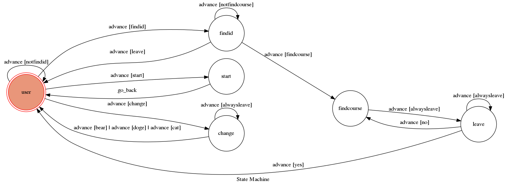

# TOC Project 2017

Template Code for TOC Project 2017

A telegram bot based on a finite state machine

## Setup

### Prerequisite
* Python 3

#### Install Dependency
```sh
pip install -r requirements.txt
```

* pygraphviz (For visualizing Finite State Machine)
    * [Setup pygraphviz on Ubuntu](http://www.jianshu.com/p/a3da7ecc5303)

### Secret Data

`API_TOKEN` and `WEBHOOK_URL` in app.py **MUST** be set to proper values.
Otherwise, you might not be able to run your code.

### Run Locally
You can either setup https server or using `ngrok` as a proxy.

**`ngrok` would be used in the following instruction**

```sh
./ngrok http 5000
```

After that, `ngrok` would generate a https URL.

You should set `WEBHOOK_URL` (in app.py) to `your-https-URL/hook`.

#### Run the sever

```sh
python3 app.py
```

## Finite State Machine


## Usage
The initial state is set to `user`.

* user
    * Reply: "Welcome to courses searching system ,enter '/change' to change character ,enter the Dept. Inst. Code you wanted to search:"
	* Input: Existed Dept. Inst. Code
		* Goto: findid

    * Input: "/start"
        * Goto: start
    
    * Input: "/change"
        * Goto: change
    
    * Input: Anything else
        * Reply: "Can't find the input Dept. Inst. Code"
        * Goto: user

* start
    * Initialize

    * Go back: user

* change
    * Reply: "Please enter number to choose the character ,1.bear ,2.dog ,3.cat"
    
    * Input: 1
        * change img and name to bear
        * Goto: user

    * Input: 2
        * change img and name to dog
        * Goto: user

    * Input: 3
        * change img and name to cat
        * Goto: user

    * Input: Anything else
        * Goto: change

* findid
    * Reply: "Find Dept. Inst. Code ,please enter Serial Number, enter '/leave' to leave:"
	
    * Input: Existed Serial Number
        * Goto: findcourse

    * Input: "/leave"
        * Goto: user

    * Input: Anything else
        * Reply "Can't find the input Serial Number"
        * Goto: findid

* findcourse
	* Reply: "Find Course:... ,Space Available is:... ,enter anything to quit:"
    
    * Input: Anything
        * Goto: leave

* leave
    * Reply: "Sure to leave? enter '/yes' to leave, enter '/no' to go back:"

    * Input: "/yes"
        * Goto: user

    * Input: "/no"
        * Goto: findcourse
    
    * Input: Anything else
        * Goto leave

## Author
[illusion030](https://github.com/illusion030)
